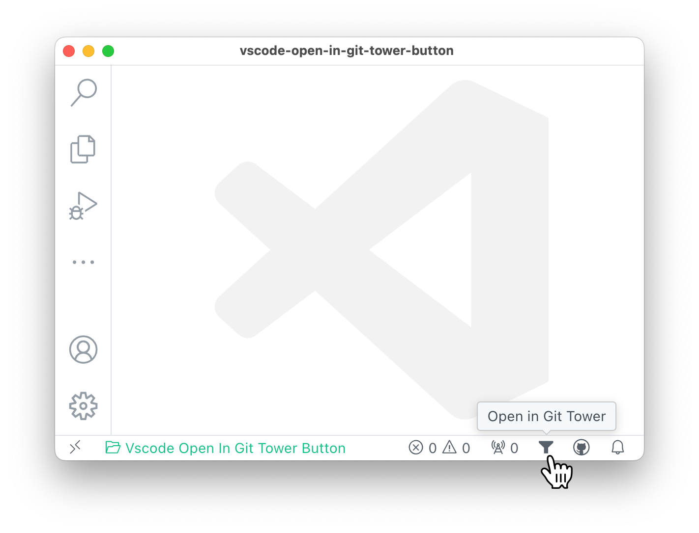

<!--+ Warning: Content inside HTML comment blocks was generated by mdat and may be overwritten. +-->

<!-- title { titleCase: true, prefix: "VS Code \"", postfix: "\" Extension" } -->

# VS Code "Open In Git Tower Button" Extension

<!-- /title -->

<!-- badges {
  custom: {
    "Visual Studio Marketplace Version": {
      image: "https://img.shields.io/visual-studio-marketplace/v/kitschpatrol.open-in-git-tower-button.svg?color=eee&amp;label=VS%20Code%20Marketplace&logo=visual-studio-code",
      link: "https://marketplace.visualstudio.com/items?itemName=kitschpatrol.open-in-git-tower-button",
    },
  }
} -->

[](https://opensource.org/licenses/MIT)
[](https://marketplace.visualstudio.com/items?itemName=kitschpatrol.open-in-git-tower-button)

<!-- /badges -->

<!-- short-description -->

**Open the current repository in the Tower Git client via a button in the VS Code status bar.**

<!-- /short-description -->

## Getting started

_Let's assume you have [VS Code](https://code.visualstudio.com/) and [Tower](https://www.git-tower.com/) installed._

Install the extension from the [Marketplace](https://marketplace.visualstudio.com/items?itemName=kitschpatrol.open-in-git-tower-button), or run the following in VS Code's command palette:

```sh
ext install kitschpatrol.open-in-git-tower-button
```

After which you should see a new icon in your status bar:



Due to a lack of an ideal [codicon](https://microsoft.github.io/vscode-codicons/dist/codicon.html), the solid "filter" icon will have to suffice with its tower-approximating silhouette.

## Maintainers

[@kitschpatrol](https://github.com/kitschpatrol)

## Acknowledgments

This trivial extension layers over [Fabio Spampinato's](https://fabiospampinato.com/) [Open in GitTower](https://github.com/fabiospampinato/vscode-open-in-gittower), which does the heavy lifting of actually opening things in Tower.

[Anthony Fu's](https://antfu.me/) [VS Code Open in GitHub Button](https://github.com/antfu/vscode-open-in-github-button) extension provided a basic template for the approach.

<!-- contributing -->

## Contributing

[Issues](https://github.com/kitschpatrol/vscode-open-in-git-tower-button/issues) and pull requests are welcome.

<!-- /contributing -->

<!-- license -->

## License

[MIT](license.txt) © Eric Mika

<!-- /license -->
