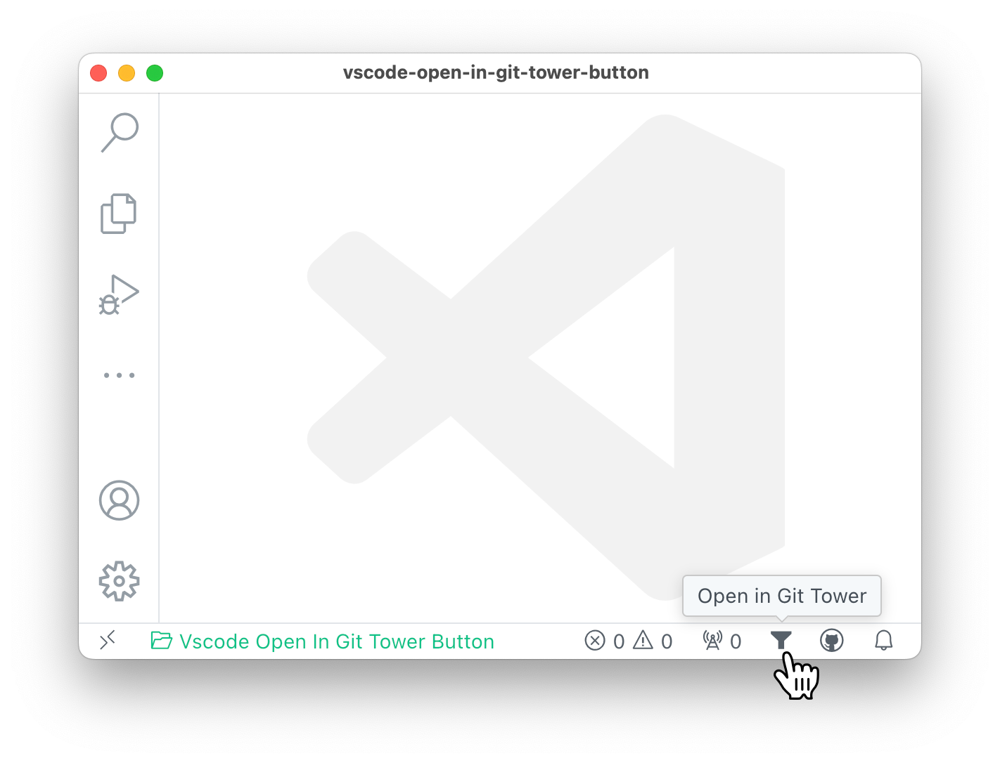

<!-- title({ titleCase: true, prefix: "VS Code ", postfix: " Extension" }) -->

# VS Code Open In Git Tower Button Extension

<!-- /title -->

<!-- badges({
  npm: [],
  custom: {
    "Visual Studio Marketplace Version": {
      image: "https://img.shields.io/badge/dynamic/json?url=https%3A%2F%2Fraw.githubusercontent.com%2Fkitschpatrol%2Fvscode-open-in-git-tower-button%2Frefs%2Fheads%2Fmain%2Fpackage.json&query=version&label=VS%20Code%20Marketplace",
      link: "https://marketplace.visualstudio.com/items?itemName=kitschpatrol.open-in-git-tower-button",
    },
  }
}) -->

[](https://opensource.org/licenses/MIT)
[](https://github.com/kitschpatrol/vscode-open-in-git-tower-button/actions/workflows/ci.yml)
[](https://marketplace.visualstudio.com/items?itemName=kitschpatrol.open-in-git-tower-button)

<!-- /badges -->

<!-- short-description -->

**Open the current repository in the Tower Git client via a button in the VS Code status bar.**

<!-- /short-description -->

## Getting started

_Let's assume you have [VS Code](https://code.visualstudio.com) and [Tower](https://www.git-tower.com) installed._

Install the extension from the [Marketplace](https://marketplace.visualstudio.com/items?itemName=kitschpatrol.open-in-git-tower-button), or run the following in VS Code's command palette:

```sh
ext install kitschpatrol.open-in-git-tower-button
```

After which you should see a new icon in your status bar:



Due to a lack of an ideal [codicon](https://microsoft.github.io/vscode-codicons/dist/codicon.html), the solid "filter" icon will have to suffice with its tower-approximating silhouette.

## Maintainers

[kitschpatrol](https://github.com/kitschpatrol)

## Acknowledgments

This trivial extension layers over [Fabio Spampinato's](https://fabiospampinato.com) [Open in GitTower](https://github.com/fabiospampinato/vscode-open-in-gittower), which does the heavy lifting of actually opening things in Tower.

[Anthony Fu's](https://antfu.me) [VS Code Open in GitHub Button](https://github.com/antfu/vscode-open-in-github-button) extension provided a basic template for the approach.

<!-- contributing -->

## Contributing

[Issues](https://github.com/kitschpatrol/vscode-open-in-git-tower-button/issues) are welcome and appreciated.

Please open an issue to discuss changes before submitting a pull request. Unsolicited PRs (especially AI-generated ones) are unlikely to be merged.

This repository uses [@kitschpatrol/shared-config](https://github.com/kitschpatrol/shared-config) (via its `ksc` CLI) for linting and formatting, plus [MDAT](https://github.com/kitschpatrol/mdat) for readme placeholder expansion.

<!-- /contributing -->

<!-- license -->

## License

[MIT](LICENSE.txt) © [Eric Mika](https://ericmika.com)

<!-- /license -->
